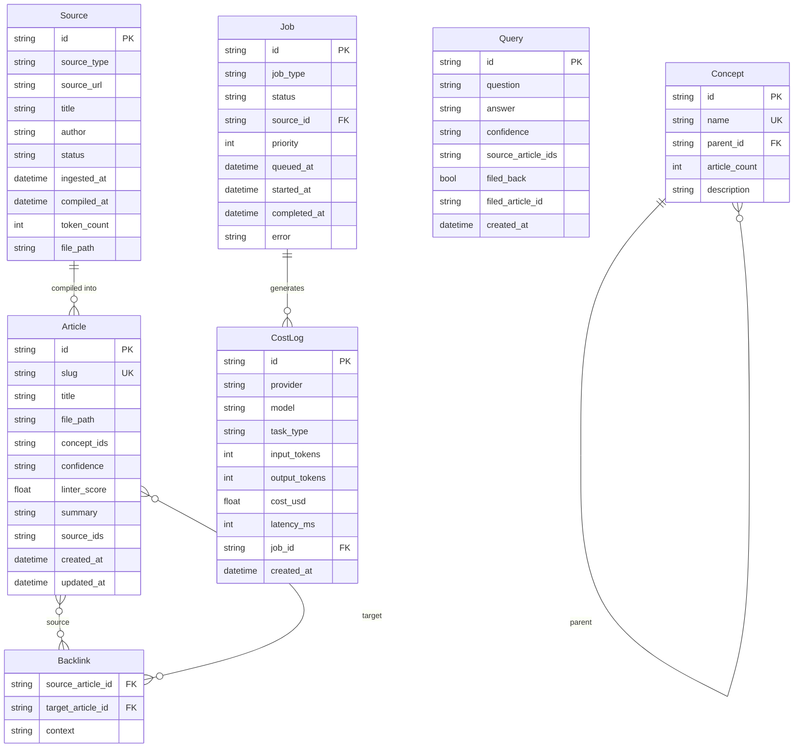
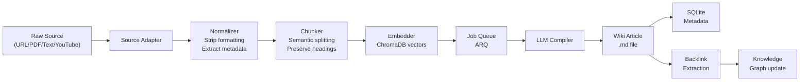
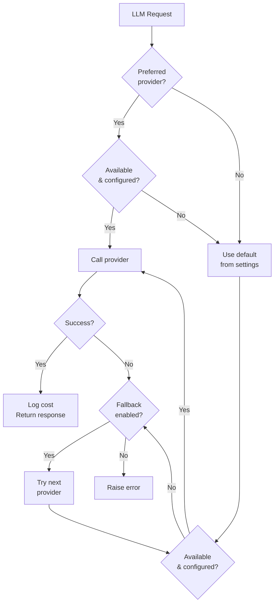

# WikiMind — Architecture

## System Diagram

```
┌─────────────────────────────────────────────────────────────────┐
│                        CLIENT LAYER                             │
│         Desktop App (Electron) + Web App (React)                │
└────────────────────────┬────────────────────────────────────────┘
                         │ REST + WebSocket (localhost:7842)
┌────────────────────────▼────────────────────────────────────────┐
│                      LOCAL GATEWAY                              │
│                  FastAPI (Python) daemon                        │
│                                                                 │
│  ┌─────────────┐  ┌─────────────┐  ┌──────────────────────┐   │
│  │ Ingest      │  │ LLM Engine  │  │ Knowledge Store      │   │
│  │ Service     │  │ Orchestrator│  │ Manager              │   │
│  └─────────────┘  └─────────────┘  └──────────────────────┘   │
│                                                                 │
│  ┌─────────────┐  ┌─────────────┐  ┌──────────────────────┐   │
│  │ Job Queue   │  │ Event Bus   │  │ Sync Engine          │   │
│  │ (ARQ)       │  │ (WebSocket) │  │                      │   │
│  └─────────────┘  └─────────────┘  └──────────────────────┘   │
└────────────────────────┬────────────────────────────────────────┘
                         │
          ┌──────────────┼──────────────┐
          │              │              │
┌─────────▼──────┐ ┌─────▼──────┐ ┌───▼──────────────┐
│ Local Storage  │ │ LLM        │ │ Cloud Sync       │
│ .md files      │ │ Providers  │ │ (Fly.io + R2)    │
│ SQLite         │ │ Claude     │ │                  │
│ ChromaDB       │ │ OpenAI     │ │                  │
│                │ │ Gemini     │ │                  │
│                │ │ Ollama     │ │                  │
└────────────────┘ └────────────┘ └──────────────────┘
```

## Data Model



## Ingest Pipeline



## LLM Provider Selection



## Compilation Prompt Contract

Input: Raw source text + metadata
Output: Structured JSON →

```json
{
  "title": "Concise article title",
  "summary": "Two sentences. What and why it matters.",
  "key_claims": [
    {
      "claim": "Specific falsifiable claim",
      "confidence": "sourced | inferred | opinion",
      "quote": "Optional direct quote under 15 words"
    }
  ],
  "concepts": ["concept-a", "concept-b"],
  "backlink_suggestions": ["Related article title"],
  "open_questions": ["Gap this source raises"],
  "article_body": "Full markdown article 300+ words"
}
```

## File System Layout

```
~/.wikimind/
├── config/
│   └── settings.toml         # Non-sensitive settings
├── raw/                       # Original source files (immutable)
│   ├── {uuid}.pdf
│   ├── {uuid}.html
│   └── {uuid}.txt
├── wiki/                      # Compiled articles
│   ├── index.md               # Auto-maintained master index
│   ├── {concept}/
│   │   └── {slug}.md
│   └── _meta/
│       ├── backlinks.json
│       ├── concepts.json
│       └── health.json        # Latest linter report
└── db/
    ├── wikimind.db            # SQLite metadata
    └── chroma/                # ChromaDB embeddings
```

## WebSocket Event Reference

All events pushed from gateway → UI:

| Event | Payload | When |
|---|---|---|
| `connected` | `{message}` | On WebSocket connect |
| `job.progress` | `{job_id, pct, message}` | During any job |
| `compilation.complete` | `{article_slug, article_title}` | Source compiled |
| `compilation.failed` | `{source_id, error}` | Compilation error |
| `sync.complete` | `{pushed, pulled, conflicts}` | After cloud sync |
| `linter.alert` | `{type, articles}` | Linter finds issues |
| `keepalive` | — | Every 30s |

Client sends:

| Message | Payload | Purpose |
|---|---|---|
| `ping` | `{type: "ping"}` | Keepalive response |

## Performance Targets

| Metric | Target |
|---|---|
| Compilation latency (single source) | < 30s p95 |
| Q&A response time | < 5s p95 |
| Search latency | < 200ms |
| App cold start to ready | < 8s |
| Sync push (100 articles) | < 60s |
| Linter run (500 article wiki) | < 5 min |
| Gateway memory footprint | < 300MB resident |
