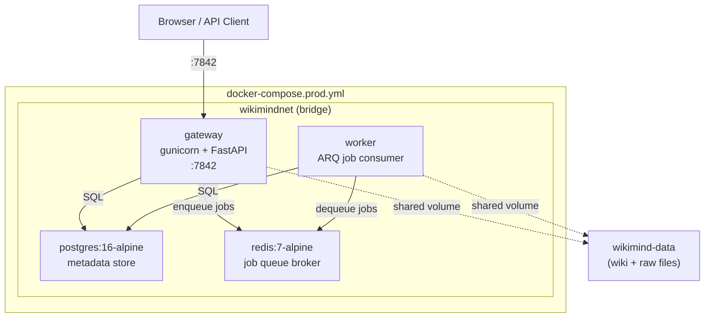

# ADR-023: Production Container Architecture

**Status:** Accepted  
**Date:** 2026-04-18  
**Issue:** [#199](https://github.com/manavgup/wikimind/issues/199)

## Context

WikiMind needs a production deployment that bundles the full stack — API server, background worker, database, and cache — into a single `docker compose up` command. The architecture must support two modes: local dev (SQLite, no Redis) and production (Postgres, Redis, multi-worker).

## Decision

### Deployment Modes

```
Dev (default)                    Production (docker-compose.prod.yml)
─────────────                    ────────────────────────────────────
SQLite (local file)              PostgreSQL 16 (container)
No Redis (in-process jobs)       Redis 7 (container)
uvicorn --reload                 gunicorn + uvicorn workers
Vite dev server (:5173)          Built frontend served by FastAPI
make dev                         make deploy-up
```

### Production Stack



### Dockerfile Multi-Stage Build

```
node:20-alpine (frontend)  ──→  npm run build  ──→  /app/dist/
                                                        │
python:3.11-slim (base)    ──→  apt-get deps            │
         │                                              │
         ├──→  dev stage (editable install, --reload)   │
         │                                              │
         └──→  prod stage ──→  pip install .[pdf]  ─────┤
                               COPY --from=frontend     │
                               COPY alembic/            │
                               COPY entrypoint.sh       │
                               ENTRYPOINT → CMD gunicorn
```

### Key Design Choices

| Choice | Rationale |
|--------|-----------|
| **FastAPI serves frontend** (no nginx) | One container serves API + React SPA. Sufficient for personal/small-team scale. Nginx can be added later if needed. |
| **Entrypoint runs Alembic** | `docker-entrypoint.sh` runs `alembic upgrade head` on Postgres before starting gunicorn. SQLite uses `create_all()` at startup instead. |
| **Named bridge network** | `wikimindnet` isolates inter-service traffic. Only the gateway port is published. |
| **All values env-parameterized** | `docker-compose.prod.yml` uses `${VAR:-default}` syntax throughout. `POSTGRES_PASSWORD` is required via `${...:?}`. Nothing hardcoded. |
| **Resource limits** | `deploy.resources` on all services prevents runaway containers. Sized for single-user/small-team. |
| **Fly.io config included** | `fly.toml` provides one-command cloud deployment with auto-stop machines and free TLS. |

### Alternatives Considered

- **nginx reverse proxy** — adds a container + config for caching/TLS. Overkill for this scale; cloud providers (Fly.io, Cloudflare) handle TLS.
- **PgBouncer connection pooler** — useful at 1000+ connections. WikiMind's `pool_size=10` is sufficient.
- **Compose profiles** (monitoring, TLS) — modeled after mcp-context-forge. Deferred until needed.

## Consequences

- `make deploy-up` starts the full production stack locally
- `fly deploy` deploys to Fly.io with managed Postgres
- Dev mode (`make dev`) is unchanged — no Docker required
- Frontend is built into the prod image — no separate web server needed
- Alembic migrations run automatically on every deployment
