# LLM Compilation Pipeline

The compiler is the core value-creation step in WikiMind. It transforms raw source documents into structured wiki articles using an LLM.

## Pipeline Overview



## Prompt Contract

The compiler sends a system prompt instructing the LLM to respond with valid JSON. The output schema:

```json
{
  "title": "Concise, specific article title",
  "page_type": "source",
  "summary": "Exactly 2 sentences. What this is and why it matters.",
  "key_claims": [
    {
      "claim": "Specific, falsifiable claim from the source",
      "confidence": "sourced|inferred|opinion",
      "quote": "Optional direct quote under 15 words"
    }
  ],
  "concepts": ["concept-name-1", "concept-name-2"],
  "backlink_suggestions": [
    {
      "target": "Title of related article",
      "relation_type": "references|extends|supersedes"
    }
  ],
  "open_questions": ["Question this source raises but does not answer"],
  "article_body": "Full markdown article. 300+ words."
}
```

Key rules enforced by the system prompt:

- `page_type` is always `source` for source compilations
- Every claim must be attributable to the source
- LLM inferences must be marked as `confidence=inferred`
- Backlinks only to genuinely related concepts
- No fabricated quotes or statistics
- Existing concept names must be reused (injected into the prompt)

## Concept ID Registry

To prevent concept fragmentation (e.g., "machine-learning" vs "ML" vs "machine learning"), the compiler injects all existing concept names into the user prompt:

```
Existing concepts in this wiki (REUSE these before inventing new ones):
artificial-intelligence, machine-learning, neural-networks, ...
```

## Chunked Compilation

Documents exceeding 80,000 tokens are split into chunks and compiled separately. The merger combines:

- All key claims (capped at 20)
- All unique concepts (capped at 10)
- All unique backlink suggestions (capped at 10)
- All unique open questions (capped at 5)
- Article bodies joined with `---` separators

The first chunk's summary is used as the merged article's summary.

## Article Persistence

After compilation, the article is saved in two places:

1. **Filesystem** -- A markdown file at `wiki/{concept-slug}/{article-slug}.md` with YAML frontmatter
2. **Database** -- An `Article` row with metadata (slug, title, file_path, confidence, concepts, source IDs, provider)

### Frontmatter

Every article file includes frontmatter for metadata:

```yaml
---
title: "Article Title"
slug: article-slug
page_type: source
source_id: uuid
source_url: https://...
source_type: url
compiled: 2025-01-15T10:30:00
concepts: [concept-a, concept-b]
confidence: sourced
provider: anthropic
---
```

## Backlink Resolution

The compiler resolves backlink suggestions against existing articles:

1. The LLM suggests targets as article titles with relationship types
2. WikiMind fuzzy-matches these against existing article titles
3. **Resolved** backlinks get a `Backlink` row in the database with the relationship type
4. **Unresolved** backlinks appear as `[[wikilinks]]` in the article markdown

Relationship types:

- `references` -- Mentions a related topic
- `extends` -- Builds on or adds to claims
- `supersedes` -- Newer source replaces older claims

## Recompilation

Articles can be recompiled via `POST /wiki/articles/{id}/recompile`. This:

1. Retrieves the original source
2. Runs the compiler again (possibly with a different LLM provider)
3. Replaces the article in place (same slug, same file path)
4. Refreshes backlinks and concept associations
5. Regenerates concept pages if needed

The original source file is never modified -- only the compiled article changes.

## Confidence Scoring

Overall article confidence is derived from individual claim confidences:

| Ratio of `sourced` claims | Overall confidence |
|---|---|
| >= 80% | `sourced` |
| >= 40% | `mixed` |
| < 40% | `inferred` |

## Cost Tracking

Every LLM call during compilation is logged to the `CostLog` table with:

- Provider and model used
- Input and output token counts
- Calculated USD cost
- Latency in milliseconds
- Task type (`compile`, `qa`, `ingest`, etc.)

Monthly budget is tracked and WebSocket alerts fire when thresholds are exceeded.
