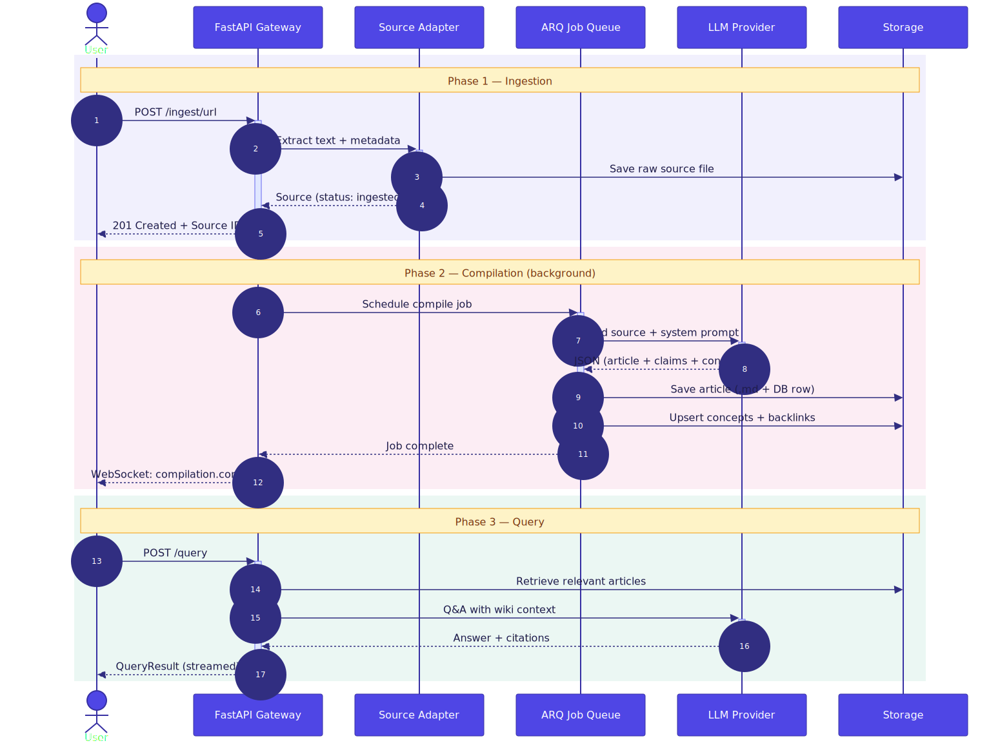

# Architecture Overview

WikiMind is a personal LLM-powered knowledge OS. The backend is a local FastAPI daemon that ingests sources, compiles them into wiki articles via LLM, and answers questions against the wiki.

## System Diagram



## Request Flow

### Ingest -> Compile -> Query



## Module Structure

```
src/wikimind/
├── main.py              # FastAPI app + lifespan
├── config.py            # Pydantic BaseSettings
├── models.py            # SQLModel tables + Pydantic schemas
├── database.py          # Async session lifecycle
├── errors.py            # Domain error hierarchy
├── storage.py           # File storage abstraction
├── api/
│   ├── deps.py          # Shared dependencies (auth, session)
│   └── routes/
│       ├── ingest.py    # Source ingestion endpoints
│       ├── wiki.py      # Article browsing, graph, search
│       ├── query.py     # Q&A and conversations
│       ├── jobs.py      # Job management
│       ├── lint.py      # Wiki health audit
│       ├── settings.py  # LLM provider configuration
│       ├── auth.py      # OAuth2 authentication
│       ├── admin.py     # System diagnostics
│       └── ws.py        # WebSocket events
├── engine/
│   ├── compiler.py      # Source -> wiki article compiler
│   ├── qa_agent.py      # Q&A against the wiki
│   ├── llm_router.py    # Multi-provider LLM routing
│   ├── concept_compiler.py  # Concept page generation
│   ├── linter/          # Wiki health auditing
│   └── providers/       # Provider implementations
├── ingest/
│   ├── service.py       # Ingest orchestrator
│   └── adapters/        # URL, PDF, text, YouTube
├── services/            # Business logic layer
│   ├── ingest.py        # Ingest service (route handler delegate)
│   ├── compiler.py      # Background compilation
│   ├── query.py         # Q&A service
│   ├── wiki.py          # Wiki browsing
│   ├── taxonomy.py      # Concept taxonomy management
│   ├── linter.py        # Linter orchestration
│   └── embedding.py     # Semantic search (planned)
├── jobs/                # ARQ worker jobs
└── middleware/           # Request pipeline
    ├── auth.py          # JWT/cookie auth
    ├── correlation.py   # Request ID tracking
    ├── request_logging.py
    ├── security_headers.py
    └── error_handling.py
```

## Data Model



## Key Design Decisions

The [Architecture Decision Records](adr/index.md) document every significant design choice. Key ones include:

- **ADR-001**: FastAPI + async SQLite for local-first daemon
- **ADR-003**: Multi-provider LLM router with fallback
- **ADR-004**: Plain markdown files + SQLite metadata
- **ADR-007**: Structured JSON prompt contract between compiler and LLM
- **ADR-009**: Decoupled ingest and compilation
- **ADR-011**: Conversational Q&A thread model with file-back
- **ADR-021**: PostgreSQL compatibility for production
- **ADR-022**: Multi-user authentication via OAuth2

## Performance Targets

| Metric | Target |
|---|---|
| Compilation latency (single source) | < 30s p95 |
| Q&A response time | < 5s p95 |
| Search latency | < 200ms |
| App cold start to ready | < 8s |
| Gateway memory footprint | < 300MB resident |
