# Ingestion Adapters

WikiMind's ingestion layer transforms raw sources into normalized documents ready for LLM compilation.

## Architecture

## IngestService

The `IngestService` orchestrates all adapters. When a URL is submitted:

1. **YouTube detection** -- URLs containing `youtube.com` or `youtu.be` route to `YouTubeAdapter`
2. **PDF detection** -- URLs ending in `.pdf` route to `PDFAdapter`. If the extension is missing, the response `Content-Type` is checked. If `application/pdf`, the content is downloaded and passed to `PDFAdapter`.
3. **HTML fallback** -- Everything else goes to `URLAdapter`

## URL Adapter

Uses [trafilatura](https://trafilatura.readthedocs.io/) for HTML extraction. Trafilatura strips navigation, ads, and boilerplate, returning clean article text with metadata (title, author, published date).

**Input**: URL string
**Output**: Source row + NormalizedDocument with clean text, metadata, and token estimate

## PDF Adapter

Two extraction backends with automatic fallback:

### docling-serve (primary)

[docling-serve](https://github.com/docling-project/docling-serve) runs as a sidecar container and provides:

- Heading hierarchy preservation
- Table structure extraction
- OCR for scanned pages
- Image/figure extraction

The adapter sends PDF bytes to docling-serve's `/v1/convert/source` endpoint and receives structured markdown.

### pymupdf fallback

When docling-serve is unavailable, the adapter falls back to pymupdf (fitz) for basic text extraction. This extracts text but loses structural information.

### Vision-enhanced processing

For slide decks and image-heavy PDFs, pages with fewer characters than `WIKIMIND_VISION_TEXT_THRESHOLD` (default: 300) are rendered as images and described by a multimodal LLM. This captures content from diagrams, charts, and cover slides that text extraction misses.

### Image extraction

Docling extracts figures and tables from PDFs as images. These are:

- Saved to `~/.wikimind/images/{source_id}/`
- Served via the `/images/` static mount
- Displayed in the frontend's FiguresPanel alongside the article

Controlled by `WIKIMIND_IMAGE_EXTRACTION_ENABLED` (default: true) and `WIKIMIND_IMAGE_MAX_PER_PDF` (default: 30).

## Text Adapter

The simplest adapter -- accepts raw text content and an optional title.

**Input**: Content string + optional title
**Output**: Source row + NormalizedDocument

## YouTube Adapter

Uses `youtube-transcript-api` to extract video transcripts. Handles both `youtube.com` and `youtu.be` URL formats.

**Input**: YouTube URL
**Output**: Source row + NormalizedDocument with transcript text

## NormalizedDocument

All adapters produce a `NormalizedDocument` -- the common format consumed by the compiler:

| Field | Type | Description |
|---|---|---|
| `raw_source_id` | str | ID of the saved Source |
| `clean_text` | str | Extracted text content |
| `title` | str | Document title |
| `author` | str or None | Author if detected |
| `published_date` | str or None | Publication date if detected |
| `estimated_tokens` | int | Approximate token count |
| `chunks` | list | Pre-chunked segments for large documents |

## Deduplication

Sources are deduplicated by content hash (SHA-256 of the extracted text). The `compute_hash` utility generates the hash, and `find_source_by_hash` checks for existing sources before creating a new one.

## Chunking

Large documents are split into semantic chunks using the `chunk_text` utility. Chunks:

- Target approximately 500 tokens each (configurable)
- Preserve heading boundaries where possible
- Include overlap for context continuity

The chunked segments are stored in the NormalizedDocument and used by the compiler's chunked compilation path for documents exceeding 80K tokens.
