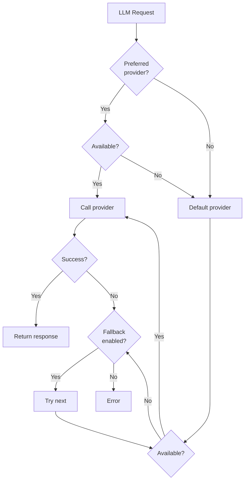

# LLM Provider Configuration

WikiMind supports multiple LLM providers with automatic selection, fallback, and cost tracking.

## Supported Providers

| Provider | Default Model | API Key Variable | Notes |
|---|---|---|---|
| Anthropic | claude-sonnet-4-5 | `ANTHROPIC_API_KEY` | Default provider |
| OpenAI | gpt-4o | `OPENAI_API_KEY` | |
| OpenAI-compatible | gpt-4o-mini | `OPENAI_COMPATIBLE_API_KEY` | Custom Chat Completions base URL |
| Google Gemini | gemini-2.0-flash | `GOOGLE_API_KEY` | |
| Ollama | llama3.2 | -- | Local, no key needed |
| Mock | mock-1 | -- | CI/testing only |

## Auto-Enable

Providers are **auto-enabled** when their API key is detected. You do not need to manually set `ENABLED=true`. Just set the key:

```bash
# This is all you need -- Anthropic auto-enables
ANTHROPIC_API_KEY=sk-ant-...
```

The auto-enable logic checks three sources:

1. Environment variable (with or without `WIKIMIND_` prefix)
2. `.env` file
3. OS keychain (via `keyring`)

To explicitly disable a provider whose key is set:

```bash
WIKIMIND_LLM__ANTHROPIC__ENABLED=false
```

## Provider Selection

The LLM router selects providers in this order:

1. **Preferred provider** -- If the request specifies one
2. **Default provider** -- Configured via `WIKIMIND_LLM__DEFAULT_PROVIDER`
3. **Fallback providers** -- All other enabled providers, in order



## Fallback

When `WIKIMIND_LLM__FALLBACK_ENABLED=true` (default), failed providers are skipped and the next available provider is tried. When disabled, the first failure raises an error.

## Model Override

Override the default model for any provider:

```bash
WIKIMIND_LLM__ANTHROPIC__MODEL=claude-haiku-4-5-20251001
WIKIMIND_LLM__OPENAI__MODEL=gpt-4o-mini
WIKIMIND_LLM__OPENAI_COMPATIBLE__MODEL=openai/gpt-4o-mini
WIKIMIND_LLM__GOOGLE__MODEL=gemini-2.0-flash
WIKIMIND_LLM__OLLAMA__MODEL=mistral
```

## OpenAI-Compatible Endpoints

Use `openai_compatible` for OpenRouter, Together, Fireworks, LM Studio,
vLLM, LocalAI, or any endpoint that supports the OpenAI Chat Completions API.
It is separate from the official `openai` provider so cost logs and article
provenance show that a gateway/custom endpoint was used.

OpenRouter example:

```bash
OPENAI_COMPATIBLE_API_KEY=sk-or-...
WIKIMIND_LLM__OPENAI_COMPATIBLE__BASE_URL=https://openrouter.ai/api/v1
WIKIMIND_LLM__OPENAI_COMPATIBLE__MODEL=openai/gpt-4o-mini
WIKIMIND_LLM__DEFAULT_PROVIDER=openai_compatible
```

Optional compatibility switches:

```bash
WIKIMIND_LLM__OPENAI_COMPATIBLE__SUPPORTS_JSON_RESPONSE_FORMAT=true
WIKIMIND_LLM__OPENAI_COMPATIBLE__SUPPORTS_STREAM_USAGE=true
WIKIMIND_LLM__OPENAI_COMPATIBLE__SUPPORTS_REASONING_EFFORT=true
WIKIMIND_LLM__OPENAI_COMPATIBLE__REASONING_FORMAT=openai
WIKIMIND_LLM__OPENAI_COMPATIBLE__MAX_TOKENS_FIELD=max_tokens
```

For gateways with OpenRouter-style reasoning payloads, set:

```bash
WIKIMIND_LLM__OPENAI_COMPATIBLE__REASONING_FORMAT=openrouter
```

For OpenRouter attribution headers:

```bash
WIKIMIND_LLM__OPENAI_COMPATIBLE__SITE_URL=https://wikimind.local
WIKIMIND_LLM__OPENAI_COMPATIBLE__APP_NAME=WikiMind
```

## Ollama (Local Models)

Ollama does not require an API key but must be explicitly enabled:

```bash
WIKIMIND_LLM__OLLAMA__ENABLED=true
WIKIMIND_LLM__DEFAULT_PROVIDER=ollama
WIKIMIND_LLM__OLLAMA__MODEL=llama3.2
WIKIMIND_LLM__OLLAMA_BASE_URL=http://localhost:11434
```

Make sure Ollama is running locally with the model pulled:

```bash
ollama pull llama3.2
ollama serve
```

## Cost Tracking

Every LLM call is logged with:

- Provider and model used
- Input and output token counts
- Calculated USD cost
- Latency in milliseconds
- Task type (compile, qa, ingest, lint)

### Pricing

Current pricing (USD per 1M tokens):

| Provider | Model | Input | Output |
|---|---|---|---|
| Anthropic | claude-sonnet-4-5 | $3.00 | $15.00 |
| Anthropic | claude-haiku-4-5-20251001 | $0.80 | $4.00 |
| OpenAI | gpt-4o | $2.50 | $10.00 |
| OpenAI | gpt-4o-mini | $0.15 | $0.60 |
| OpenAI-compatible | * | $0.00 | $0.00 |
| Google | gemini-2.0-flash | $0.10 | $0.40 |
| Ollama | * | $0.00 | $0.00 |

### Budget Management

Set a monthly spending ceiling:

```bash
WIKIMIND_LLM__MONTHLY_BUDGET_USD=50.0
WIKIMIND_LLM__BUDGET_WARNING_PCT=0.8
```

When spending reaches 80% of the budget, a WebSocket `budget.warning` event is emitted. At 100%, a `budget.exceeded` event fires. These are displayed in the UI.

View current spending via the API:

```bash
curl http://localhost:7842/settings/costs
```

## Mock Provider (Testing)

For CI and local testing without real API calls:

```bash
WIKIMIND_LLM__MOCK__ENABLED=true
WIKIMIND_LLM__DEFAULT_PROVIDER=mock
```

The mock provider returns deterministic canned responses for all task types. It never makes network calls and costs nothing.

!!! danger "Do not use in production"
    The mock provider returns static responses that do not reflect your actual source content.

## API Key Storage

API keys can be stored in three locations (checked in order):

1. **Environment variable** -- `ANTHROPIC_API_KEY=sk-ant-...` (with or without `WIKIMIND_` prefix)
2. **`.env` file** -- Loaded automatically by Pydantic BaseSettings
3. **OS keychain** -- Stored via the `keyring` library

Store a key in the keychain:

```python
import keyring
keyring.set_password("wikimind", "anthropic", "sk-ant-...")
```

Keys stored as `SecretStr` are never logged in plaintext.

## Runtime Preferences

Some LLM settings can be changed at runtime without restarting:

```bash
# Change default provider
curl -X PUT http://localhost:7842/settings/preferences \
  -H "Content-Type: application/json" \
  -d '{"key": "llm.default_provider", "value": "openai"}'

# Change monthly budget
curl -X PUT http://localhost:7842/settings/preferences \
  -H "Content-Type: application/json" \
  -d '{"key": "llm.monthly_budget_usd", "value": "100.0"}'
```

Runtime preferences are stored in the database and applied on startup.
